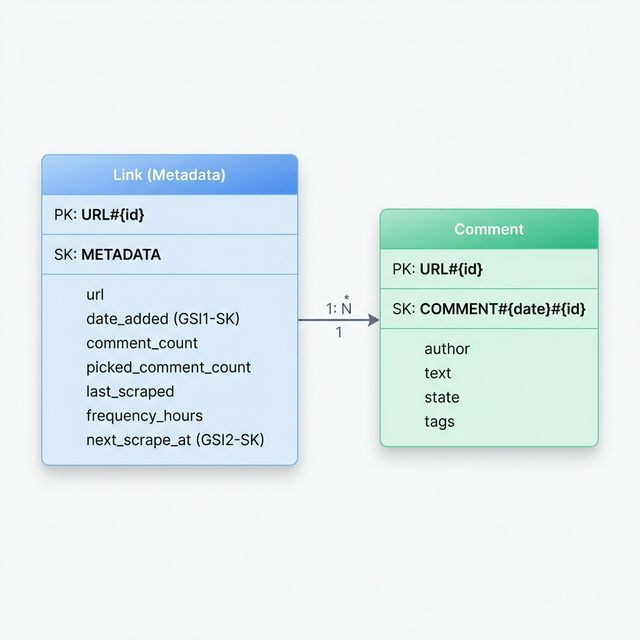

# DynamoDB Schema Proposals for rust-yscraper

This document outlines two proposed DynamoDB schemas to replace the existing PostgreSQL storage for links and comments.

## Access Patterns Analysis

The current system relies on the following key access patterns:

1.  **List Links**: Fetch all URLs sorted by `date_added` DESC.
2.  **Get Link Metadata**: Fetch a specific URL's details (counts, scheduling).
3.  **Paginate Comments**: Fetch comments for a specific `url_id`, sorted by `date` DESC, with optional filtering by `state`.
4.  **Scheduled Tasks**: Find URLs that are due for a refresh (`last_scraped + frequency < now` and within `days_limit`).
5.  **Upsert Comments**: Batch insert/update comments for a URL.
6.  **Atomic Updates**: Update `comment_count` and `picked_comment_count` when comment states change.

---

## Proposal 1: Single-Table Design (Highly Optimized)

This proposal uses a single table to store both Links and Comments. This is the standard "DynamoDB Way" to minimize requests and handle relationships.

### Table Structure

- **Table Name**: `YScraperData`
- **PK (Partition Key)**: `ID` (String)
- **SK (Sort Key)**: `SORT_KEY` (String)

| Entity Type | PK | SK | Attributes |
| :--- | :--- | :--- | :--- |
| **Link** | `URL#{url_id}` | `METADATA` | `url`, `date_added`, `comment_count`, `picked_comment_count`, `last_scraped`, `frequency`, `days_limit` |
| **Comment** | `URL#{url_id}` | `COMMENT#{date}#{id}` | `author`, `text`, `state`, `tags` |

### Global Secondary Indexes (GSIs)

1.  **GSI1: Listing & Global Sorting**
    - **PK**: `ENTITY_TYPE` (e.g., `LINK`)
    - **SK**: `date_added` (For Links) or `date` (For Comments)
    - **Purpose**: Power the "List Links" page and global feed.

2.  **GSI2: Scheduling**
    - **PK**: `CAN_SCRAPE` (Boolean or "YES")
    - **SK**: `next_scrape_at` (Computed timestamp: `last_scraped + frequency`)
    - **Purpose**: Efficiently find tasks due for processing.

### Database Schema Diagram



### Tradeoffs (Proposal 1)

**Pros:**
- **Performance**: Fetching a link and its recent comments can be done in a single `Query` request.
- **Cost**: Fewer tables = less overhead for provisioned throughput or base cost.
- **Relational Integrity**: Easier to perform "Delete Link" by deleting all items with the same PK prefix.

**Cons:**
- **Complexity**: Single-table design requires more careful planning and harder-to-read raw data in the AWS Console.
- **Index Latency**: Global sorting depends on GSIs, which have eventual consistency.

---

## Proposal 2: Simple Multi-Table Design

Two separate tables, mirroring the relational structure.

### Table: `YScraperLinks`
- **PK**: `id`
- **GSI1-PK**: `CONSTANT_VAL` (for listing) | **GSI1-SK**: `date_added`

### Table: `YScraperComments`
- **PK**: `url_id`
- **SK**: `COMMENT#{date}#{id}` (for pagination)

### Tradeoffs (Proposal 2)

**Pros:**
- **Simplicity**: Mapping from existing Rust structs is straightforward.
- **Isolation**: High-volume comment writes won't affect Link metadata read throughput.

**Cons:**
- **Dual-request overhead**: Must perform two separate calls to backend to get Link + Comments.
- **Cross-table consistency**: No way to perform atomic updates across both items (except via DynamoDB Transactions, which are more expensive).

---

## Technical Recommendation

I recommend **Proposal 1 (Single-Table Design)**. 

### Why?
1.  **Total Record Count**: Even with thousands of links and many more comments, the total data size is relatively small for DynamoDB Scale.
2.  **Optimization**: The "List Links" view frequently needs to display the `comment_count`. In Single-Table design, this is part of the `METADATA` item.
3.  **Atomic Counts**: When a scraper adds 10 new comments, we can use a **TransactWriteItem** to save the comments and increment the `comment_count` on the `METADATA` item in a single atomic operation, ensuring counts never drift.

### Potential Data Mapping (Rust)

```rust
#[derive(Serialize, Deserialize)]
pub struct TableItem {
    pub pk: String, // URL#123
    pub sk: String, // METADATA or COMMENT#2024-01-01#456
    #[serde(flatten)]
    pub data: EntityData,
}

#[derive(Serialize, Deserialize)]
#[serde(untagged)]
pub enum EntityData {
    Link(LinkAttributes),
    Comment(CommentAttributes),
}
```
